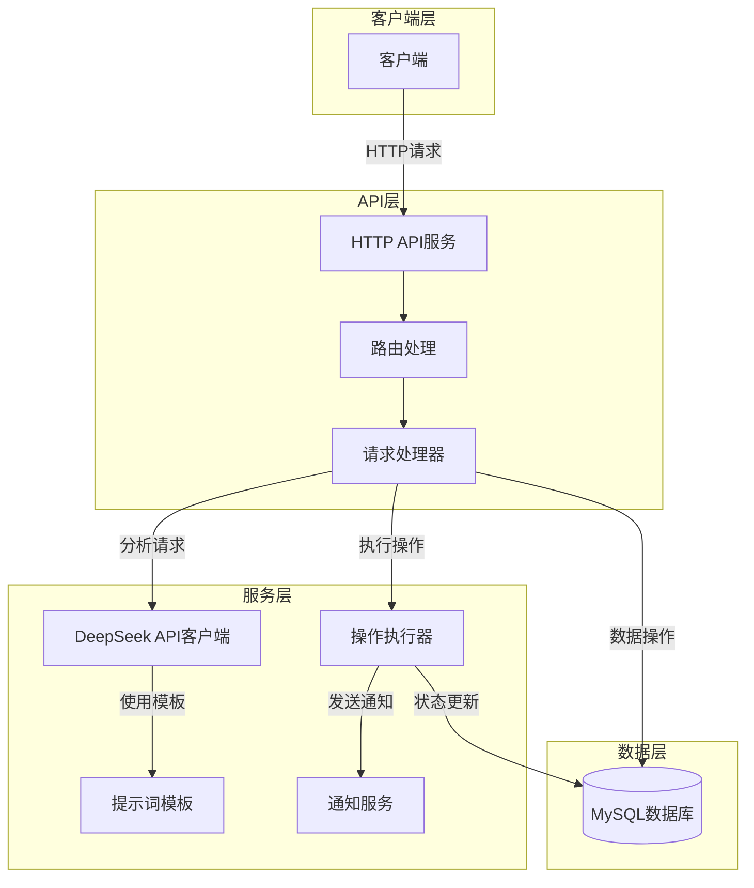
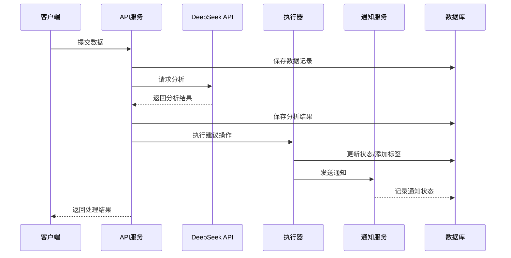
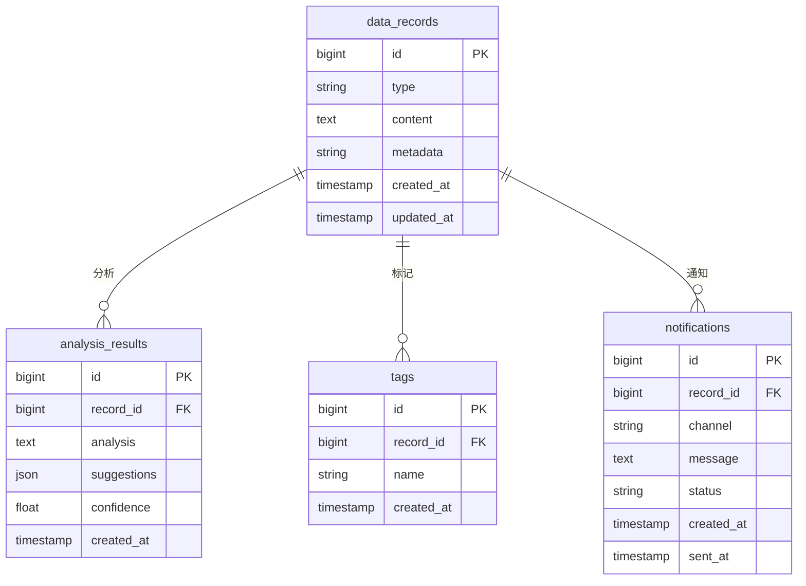

# DeepSeek API 集成示例

> 本项目由 Trae AI 辅助编写

一个基于 DeepSeek API 的智能数据分析和自动化处理系统，提供多类型数据分析、自动化操作和可扩展的系统架构。系统能够处理文本、指标和日志等多种数据类型，实现智能分析、自动标记和通知推送等功能，帮助用户高效处理和管理数据。

## 功能特点

1. **多类型数据分析**

    - 文本分析：提取关键信息、情感分析、紧急程度评估
    - 指标分析：统计分析、异常检测、趋势预测
    - 日志分析：错误诊断、影响评估、频率分析

2. **自动化操作**

    - 数据库操作：状态更新、标签管理
    - 通知推送：邮件、短信、Webhook
    - 数据标记：自动分类和标记

3. **可扩展架构**
    - 模块化设计
    - 插件式操作处理
    - 灵活的提示词模板

## 系统架构



## 环境准备

### 数据库初始化

1. 启动 MariaDB 容器

```bash
docker run -d \
    --name deepseek-mariadb \
    -e MYSQL_ROOT_PASSWORD=root \
    -e MYSQL_DATABASE=deepseek_demo \
    -e MYSQL_USER=deepseek \
    -e MYSQL_PASSWORD=deepseek123 \
    -p 3306:3306 \
    mariadb:latest
```

2. 等待容器启动完成后，数据库将自动创建，可以使用以下命令验证连接：

```bash
docker exec deepseek-mariadb mysql -udeepseek -pdeepseek123 -e "SELECT 'Connection successful!'" deepseek_demo
```

3. 数据库配置说明

项目使用 `.env` 文件配置数据库连接信息，请参考 `.env.example` 创建：

```env
DB_DSN=deepseek:deepseek123@tcp(localhost:3306)/deepseek_demo?parseTime=true
```

## 数据流程



## 数据库设计



## API 接口

### 1. 创建数据记录

创建一个新的数据记录，支持文本、指标和日志三种类型的数据。

**请求路径**

```
POST /api/records
```

**请求参数**

| 字段     | 类型   | 必填 | 说明                                                  |
| -------- | ------ | ---- | ----------------------------------------------------- |
| type     | string | 是   | 数据类型，可选值：text(文本)、metric(指标)、log(日志) |
| content  | string | 是   | 数据内容                                              |
| metadata | string | 否   | 数据相关的元数据，可以是 JSON 字符串                  |

**响应字段**

| 字段      | 类型   | 说明     |
| --------- | ------ | -------- |
| id        | number | 记录 ID  |
| type      | string | 数据类型 |
| content   | string | 数据内容 |
| metadata  | string | 元数据   |
| createdAt | string | 创建时间 |
| updatedAt | string | 更新时间 |

**请求示例**

```bash
curl -X POST http://localhost:8080/api/records \
  -H "Content-Type: application/json" \
  -d '{
    "type": "text",
    "content": "你好，我在使用贵公司服务的时候遇到了问题，在你们在线帮助中没有获得有用的信息。请帮我联系你们的人工客服解决问题。",
    "metadata": "{\"source\": \"user_feedback\", \"priority\": \"high\"}"
  }'
```

**响应示例**

```json
{
    "id": 1,
    "type": "text",
    "content": "这是一段需要分析的文本内容",
    "metadata": "{\"source\": \"user_feedback\", \"priority\": \"high\"}",
    "createdAt": "2024-01-01T00:00:00Z",
    "updatedAt": "2024-01-01T00:00:00Z"
}
```

### 2. 分析数据

对指定 ID 的数据记录进行智能分析，返回分析结果、建议和置信度。

**请求路径**

```
POST /api/analyze/{id}
```

**路径参数**

| 参数 | 类型   | 说明        |
| ---- | ------ | ----------- |
| id   | number | 数据记录 ID |

**响应字段**

| 字段        | 类型   | 说明                       |
| ----------- | ------ | -------------------------- |
| recordId    | number | 数据记录 ID                |
| analysis    | string | 分析结果文本               |
| suggestions | array  | 建议操作列表               |
| confidence  | number | 分析结果的置信度，范围 0-1 |
| createdAt   | string | 分析时间                   |

**请求示例**

```bash
curl -X POST http://localhost:8080/api/analyze/1
```

**响应示例**

```json
{
    "recordId": 1,
    "analysis": "该用户反馈表达了对产品的不满，建议优先处理",
    "suggestions": ["安排客服团队跟进", "评估是否需要产品改进"],
    "confidence": 0.95,
    "createdAt": "2024-01-01T00:00:00Z"
}
```

### 3. 获取数据记录

获取指定 ID 的数据记录详细信息，包括分析结果、标签和通知状态。

**请求路径**

```
GET /api/records/{id}
```

**路径参数**

| 参数 | 类型   | 说明        |
| ---- | ------ | ----------- |
| id   | number | 数据记录 ID |

**响应字段**

| 字段                    | 类型   | 说明             |
| ----------------------- | ------ | ---------------- |
| id                      | number | 记录 ID          |
| type                    | string | 数据类型         |
| content                 | string | 数据内容         |
| metadata                | string | 元数据           |
| createdAt               | string | 创建时间         |
| updatedAt               | string | 更新时间         |
| analysis                | object | 分析结果对象     |
| analysis.result         | string | 分析结果文本     |
| analysis.suggestions    | array  | 建议操作列表     |
| analysis.confidence     | number | 分析结果的置信度 |
| tags                    | array  | 标签列表         |
| notifications           | array  | 通知记录列表     |
| notifications[].channel | string | 通知渠道         |
| notifications[].status  | string | 通知状态         |
| notifications[].sentAt  | string | 发送时间         |

**请求示例**

```bash
curl http://localhost:8080/api/records/1
```

**响应示例**

```json
{
    "id": 1,
    "type": "text",
    "content": "这是一段需要分析的文本内容",
    "metadata": "{\"source\": \"user_feedback\", \"priority\": \"high\"}",
    "createdAt": "2024-01-01T00:00:00Z",
    "updatedAt": "2024-01-01T00:00:00Z",
    "analysis": {
        "result": "该用户反馈表达了对产品的不满，建议优先处理",
        "suggestions": ["安排客服团队跟进", "评估是否需要产品改进"],
        "confidence": 0.95
    },
    "tags": ["高优先级", "客户反馈"],
    "notifications": [
        {
            "channel": "email",
            "status": "sent",
            "sentAt": "2024-01-01T00:00:00Z"
        }
    ]
}
```
